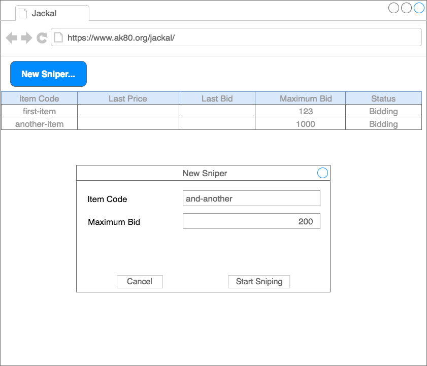

# jackal
Auction Sniper for learning along with the example from the book "Growing Object-Oriented Software Guided By Tests"

# Terms

Some basic terms

* _Item_ is something that can be identified and bought.
* _Bidder_ is a person or organization that is interested in buying an item.
* _Bid_ is a statement that a bidder will pay a given price for an item.
* _Current price_ is the current highest bid for the item.
* _Stop price_ is the most a bidder is prepared to pay for the item.
* _Auction_ is a process for managing bids for an item.
* _Auction house_ is an institution that hosts auctions.

# Givens

* There is an auction for every item, an items identifier can be used to refer to its auction.
* Handling of bought items is not necessary.

# UI

* Build the UI as a web interface
* It will allow a user to bid for multiple items at a time
* It will show the identifier, stop proce, and the current auction price and status for each item it's sniping
* Buyers will be able to add new items for sniping through the UI and the displa values will change in response to events arriving from the auction house

# Auction Protocol

with XMPP

Bidders send _commands_:

** Join** bidder joins action. Sender identifies the bidder, name of chat session identifies the item
**Bid** bidder sends bidding price to auction

Auctions send _events_:

**Price** send to a bidder when he joins, and to all whenever a new bid has been acceptes. reports currently accepted price, the bidder who bid it and the minimum increment for the next bid
**Close** announces the close of an action, the winner of the last price event has won the auction

A Sniper _joins_ an auction, there are some rounds of _bidding_ until the auction _closes_ and the Sniper will either have _won_ or _lost_

Example 
{{{
SOLVersion: 1.1; Command: JOIN;
SOLVersion: 1.1; Event: PRICE; CurrentPrice 192; Increment: 7; Bidder: Someone else;
SOLVersion: 1.1; Command: BID; Price 199;
SOLVersion: 1.1; Event: CLOSE;
}}}

To bid for an item 12345 a client starts a chat with _auction-12345_

# First steps

Single item: join, lose without bidding
Single item: join, bid and lose
Single item: join, bid and win
Show price details
Multiple items
Add items through the UI
Stop bidding at the stop price

# Test setup
 
 For the openfire server, use the docker-compose file. Add accounts with password
  * sniper / sniper
  * auction-item-54321 /action
  * auction-item-65432 / auction